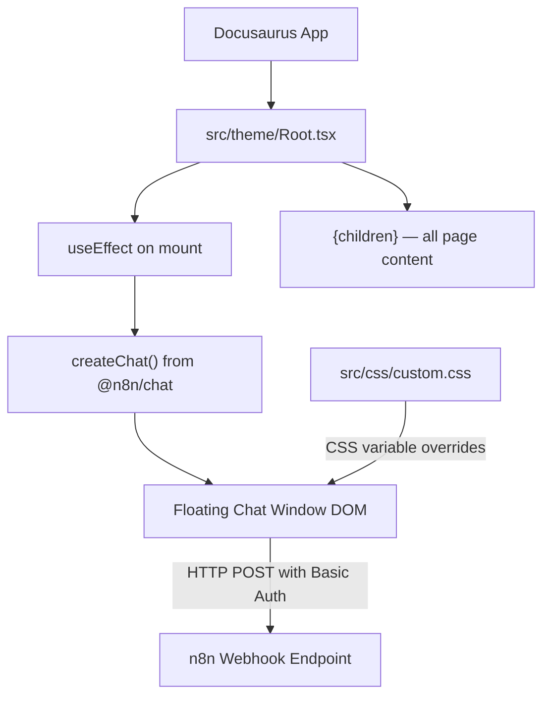

# Design Document: n8n Chat Widget

## Overview

This design replaces the custom-built chat widget (`src/components/ChatWidget/`) with the `@n8n/chat` embedded widget. The existing widget is a bespoke React implementation with streaming, citations, and suggestion chips that connects to a non-functioning AWS Lambda RAG backend. The replacement uses the `@n8n/chat` package's `createChat()` function to render a pre-built floating chat window that communicates with an n8n webhook endpoint via Basic Auth.

The change is frontend-only. All Lambda/CloudFormation infrastructure remains untouched.

### Key Design Decisions

1. **`createChat()` in `useEffect`** — The `@n8n/chat` package is not a React component. It imperatively mounts a chat widget into the DOM. We call `createChat()` inside a `useEffect` hook in `Root.tsx` to initialize it once on mount.
2. **No wrapper component** — Since `createChat()` self-manages its DOM, there's no need for a dedicated React component file. The initialization lives directly in `Root.tsx`.
3. **CSS variables for branding** — `@n8n/chat` exposes CSS custom properties for theming. We override these in `src/css/custom.css` to match the 1NCE brand, keeping all style customization in one place.
4. **Hardcoded Basic Auth header** — The webhook requires Basic Auth. The base64-encoded credentials are included directly in the `webhookConfig.headers` object. The password is a deployment-time value (not a user secret).

## Architecture



The architecture is minimal:

1. `Root.tsx` wraps all Docusaurus page content and calls `createChat()` once on mount.
2. `createChat()` injects the chat widget DOM (toggle button + chat window) into `document.body`.
3. The widget sends messages to the n8n webhook endpoint with Basic Auth headers.
4. CSS variables in `custom.css` override the widget's default theme to match 1NCE branding.

### File Changes Summary

| File | Action |
|------|--------|
| `package.json` | Add `@n8n/chat` to `dependencies` |
| `src/theme/Root.tsx` | Replace ChatWidget import with `createChat()` + `useEffect` |
| `src/css/custom.css` | Add `@n8n/chat` CSS variable overrides |
| `src/components/ChatWidget/*` | Delete entire directory |

## Components and Interfaces

### Root.tsx (Modified)

```typescript
import React, { useEffect } from 'react';
import '@n8n/chat/style.css';

export default function Root({ children }: { children: React.ReactNode }) {
  useEffect(() => {
    import('@n8n/chat').then(({ createChat }) => {
      createChat({
        webhookUrl: 'https://n8n.dev.1nce.ai/webhook/cd4f96e9-4577-428e-bc50-27efee023e1f/chat',
        webhookConfig: {
          method: 'POST',
          headers: {
            Authorization: 'Basic ' + btoa('master:[PLACEHOLDER_PASSWORD]'),
          },
        },
        mode: 'window',
        showWelcomeScreen: false,
        initialMessages: [
          'Hello! 👋 I\'m the 1NCE Developer Hub assistant.',
          'Ask me anything about 1NCE IoT connectivity, APIs, or platform services.',
        ],
        i18n: {
          en: {
            title: '1NCE Dev Hub Assistant',
            subtitle: 'Ask me anything about 1NCE services',
            inputPlaceholder: 'Type your question...',
            getStarted: 'New Conversation',
            closeButtonTooltip: 'Close chat',
          },
        },
      });
    });
  }, []);

  return <>{children}</>;
}
```

**Design rationale for dynamic `import()`**: The `@n8n/chat` package manipulates the DOM directly. Using a dynamic import inside `useEffect` ensures the code only runs client-side, avoiding SSR issues during Docusaurus static site generation. The CSS import (`@n8n/chat/style.css`) is a static import since Docusaurus handles CSS extraction at build time.

### CSS Variable Overrides (in `src/css/custom.css`)

```css
/* n8n Chat Widget — 1NCE brand overrides */
:root {
  --chat--color-primary: #29abe2;
  --chat--color-primary-shade-50: #1a9ad4;
  --chat--color-primary-shade-100: #1377a5;
  --chat--color-secondary: #194a7d;
  --chat--color-secondary-shade-50: #0d2a47;
  --chat--window--width: 400px;
  --chat--window--height: 600px;
  --chat--header-height: auto;
  --chat--window--z-index: 10000;
}

[data-theme='dark'] {
  --chat--color-secondary: #0d2a47;
  --chat--color-secondary-shade-50: #091e36;
}
```

The z-index of `10000` ensures the chat floats above the Docusaurus navbar (z-index ~400) and any OpenAPI docs overlays.

### Deleted Components

The entire `src/components/ChatWidget/` directory is removed:
- `ChatButton.tsx`, `ChatDrawer.tsx`, `ChatInput.tsx`, `ChatMessage.tsx`
- `CitationList.tsx`, `SuggestionChips.tsx`
- `ChatWidget.tsx`, `ChatWidget.module.css`
- `types.ts`, `useChatStream.ts`
- `__tests__/` directory and all test files

## Data Models

This feature has no custom data models. The `@n8n/chat` package manages its own internal state (messages, session, UI state). The only data we provide is configuration:

### createChat Configuration Object

| Property | Type | Value | Purpose |
|----------|------|-------|---------|
| `webhookUrl` | `string` | n8n webhook URL | Target endpoint for chat messages |
| `webhookConfig.method` | `string` | `'POST'` | HTTP method |
| `webhookConfig.headers` | `Record<string, string>` | `{ Authorization: 'Basic ...' }` | Basic Auth credentials |
| `mode` | `'window' \| 'fullscreen'` | `'window'` | Floating overlay mode |
| `showWelcomeScreen` | `boolean` | `false` | Skip welcome, go straight to chat |
| `initialMessages` | `string[]` | Greeting messages | Shown when chat opens |
| `i18n` | `object` | Title, subtitle, placeholder | UI text customization |


## Correctness Properties

*A property is a characteristic or behavior that should hold true across all valid executions of a system — essentially, a formal statement about what the system should do. Properties serve as the bridge between human-readable specifications and machine-verifiable correctness guarantees.*

Most acceptance criteria for this feature are configuration checks (specific values passed to `createChat()`) or code-removal tasks (deleting old files, preserving infra). These are best validated as example-based tests or code review, not properties.

The one true property arises from the Basic Auth encoding requirement (2.6), which must hold for all credential pairs.

### Property 1: Basic Auth Header Encoding Round Trip

*For any* username and password string pair (containing no colon in the username), encoding them as `'Basic ' + base64(username + ':' + password)` and then decoding the base64 portion should yield the original `username:password` string.

**Validates: Requirements 2.6**

This is a round-trip property on the Base64 encoding used to construct the Authorization header. It ensures the encoding logic correctly preserves the credentials for any input, not just the specific `master:[PLACEHOLDER_PASSWORD]` pair.

## Error Handling

| Scenario | Behavior | Rationale |
|----------|----------|-----------|
| n8n webhook is unreachable | `@n8n/chat` displays its built-in error state in the chat window | We rely on the package's default error handling; no custom logic needed |
| Basic Auth credentials are rejected (401) | `@n8n/chat` displays the error response in the chat window | The webhook returns an error message that the widget renders |
| `createChat()` throws during initialization | Error is caught by React's error boundary or silently fails; site content renders normally | The dynamic `import()` + `useEffect` pattern isolates the chat from page rendering |
| CSS styles fail to load | Widget renders with default `@n8n/chat` styling (unstyled but functional) | CSS import failure is non-blocking; the widget remains usable |
| Browser does not support `btoa()` | Not a concern — `btoa()` is supported in all browsers in the project's browserslist | No polyfill needed |

The key design principle is that chat widget failures must never break the documentation site. The `useEffect` + dynamic import pattern ensures the widget initializes independently of the React render tree.

## Testing Strategy

### Dual Testing Approach

This feature uses both unit tests (example-based) and property-based tests for comprehensive coverage.

**Unit tests** cover:
- `createChat()` is called with the correct configuration object (mode, webhookUrl, showWelcomeScreen, initialMessages, i18n keys)
- The `@n8n/chat` dependency exists in `package.json`
- CSS variables for 1NCE branding are set (`--chat--color-primary: #29abe2`, `--chat--window--z-index: 10000`)
- Old `src/components/ChatWidget/` directory no longer exists
- `Root.tsx` does not import from `src/components/ChatWidget/`

**Property-based tests** cover:
- Basic Auth encoding round trip (Property 1)

### Testing Tools

- **Test runner**: Vitest (already configured in the project)
- **Property-based testing library**: `fast-check` (already in `devDependencies`)
- **DOM testing**: `@testing-library/react` + `jsdom` (already in `devDependencies`)

### Property-Based Test Configuration

- Minimum 100 iterations per property test
- Each property test must reference its design document property via comment tag

**Tag format**: `Feature: n8n-chat-widget, Property 1: Basic Auth Header Encoding Round Trip`

### Test File Location

- `src/theme/__tests__/Root.test.tsx` — unit tests for Root.tsx integration and createChat config
- `src/theme/__tests__/Root.property.test.ts` — property-based test for Basic Auth encoding

### What We Don't Test

- Visual rendering of the `@n8n/chat` widget (owned by the package)
- Webhook endpoint availability (infrastructure concern)
- Dark mode visual consistency (requires visual regression tooling)
- File deletion of old ChatWidget (verified by CI build — missing imports would fail the build)
- Infrastructure preservation (code review / diff check)
